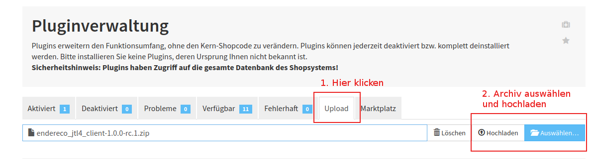

# JTL 4 Plugin - internationale Adressprüfung und Autovervollständigung - DHL Leitcode kompatibel

Der Address Management Service von Endereco bündelt viele Dienste in einem Plugin, um Kunden zu ermöglichen, 
ihre Stammdaten schnell, fehlerfrei und richtig formatiert einzugeben. So erhältst 
du korrekte Kundendaten und erleichterst deinen Kunden die Adresseingabe auf Smartphones, Tablets und Desktop PCs.

- 30 Tage kostenfrei und ohne Risiko testen!
- Keine Vertragsbindung,
- Keine Mindestlaufzeit, eine Grundgebühr, kein Mindestumsatz
- Bis 250 Prüfungen im Monat dauerhaft kostenfrei! - danach gelten die regulären Preise unter https://endereco.de/preise/
- Gratis API Key anfordern unter: https://www.endereco.de und loslegen!
- Internationale Adressprüfung / Adresscheck für Europa / weltweit für über 200 Länder
- DHL leitcodierfähige deutsche Adressen
- Autocomplete / Auto Vervollständigung / Eingabe Assistent für PLZ, Ort, Strasse
- E-Mail Prüfung auf Format und Erreichbarkeit des Postfaches sowie gültiger Länderdomains
- Anredeprüfung mit automatischem Setzen der richtigen Anrede wenn eindeutig
- Unterdrückung des Autofillls für Adressen für viele Browser um Fehleingaben zu vermeiden
- Server zu Server Kommunikation - 100% Cookiefrei - keine Aufnahme in die Cookie Richtlinie notwendig
- DSGVO Konform / Gbpr compliant
- Optionale einmalige Prüfung von Bestandskunden nach Login - vor der Bestellung
- Speicherung des Prüfstatuses in Shop zur weiteren Bearbeitung in der Warenwirtschaft
- Left to right, right to left support (z.B. für arabische Sprachen)
- Made in Germany
- Deutscher Support für Shopbetreiber und Agenturen

## Kompatibilität

Der ist kompatibel mit JTL Shop Versionen:

- 4.04
- 4.05
- 4.06

## Features

### Eingabe Assistent für PLZ, Ort, Strasse

### Adressprüfung mit Korrekturvorschlägen

### Prüfung der Bestandskunden

### Anredeprüfung

### E-Mail Prüfung

## Installation
Lade zuerst die [aktuellste Version des Plugins](https://github.com/Endereco/endereco-jtl4-client/releases/latest) herunter.

Die Datei ist ein Archiv und heißt **endereco_jtl4_client-x.x.x.zip**, wo x.x.x für die Versionsnummer steht.

Falls hinten dran noch ein **-rc.x** hängt, handelt es sich dabei um eine Entwicklerversion des Plugins. Sie enthält die neusten Features, kann aber unstabil sein. Man kann sie im Testshop testen.

Danach das Archiv einfach im Shop hochladen. Dafür im **Admin > Plugins > Pluginverwaltung** auf den Reiter "Upload" klicken, das heruntergeladene Archiv auswählen und auf "Hochladen" klicken.

Nach dem Hochladen erscheint der Plugin in der Liste der verfügbaren Plugins. Wähle ihn aus und klicke auf "Installieren".

Ist der Plugin installiert, soll bei ihm gleich ein API-Key eingetragen werden. Falls der API-Key noch nicht vorliegt, deaktivere erstmal den Plugin.

## Konfiguration

Der Plugin ist mit einer Standardkonfiguration ausgestattet und bedarf keiner Einstellung. Unvermeindlich ist jedoch Das eintragen eines API-Keys.

Für diesen API-Keys werden einzelne Dienste bei Endereco Server freigeschaltet.

Den API-Keys erstellen wir auf Anfrage bei info@endereco.de oder über unsere Website https://www.endereco.de

## Support

Für alle Fragen steht der Entwickler des Plugins, Herr Ilja Weber ilja@endereco.de oder support@endereco.de zur Verfügung.

## Release Kalender

| Datum | Phase | 
| ------------- |-------------|
| 01.03.2021 - 14.03.2021 | Release Candidate. Der Plugin wird getestet. |
| 15.03.2021 - 19.03.2021 | Release von 1.0.0. Vorbereitung der Dokumentation. Versenden von Newsletter. |
| 22.03.2021 - 23.04.2021 | Entwicklung. Wir entwickeln neue Features. |
| 26.04.2021 - 30.04.2021 | Merge Window. Wir integrieren neue Features in die nächste Version des Plugins. |
| 03.05.2021 - 16.05.2021 | Release Candidate. Der Plugin wird getestet. |
| 15.03.2021 - 19.03.2021 | Release von 1.1.0. Vorbereitung der Dokumentation. Versenden von Newsletter. |

Updates folgen...

